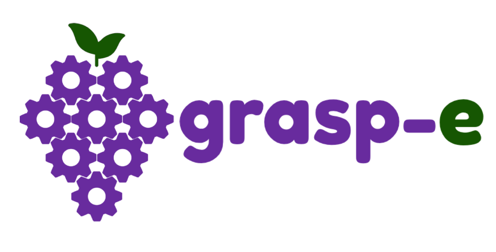

  

# Introduction

This project was developed as part of an academic assignment during our undergraduate studies. The objective of the assignment was to design a robotic manipulator to solve a problem freely chosen by the students, applying the concepts learned throughout the course.

The Grasp-e project consists of a robotic manipulator designed to implement the thinning and harvesting technique in grapevines, with a special focus on table grapes.

## About the project

This is the third version of Grasp-e, a robotic manipulator developed and improved across three different academic courses, each introducing new challenges and design requirements. The first and second versions can be found in the [Graspe repository](https://github.com/JPBG-USP/graspe).

In the first course, we developed the initial version of Grasp-e entirely in simulation using ROS and Gazebo.
In the second version, we redesigned the manipulator for real-world implementation, using factory-controlled servo motors.

Finally, in this third version, we modified the servo hardware and electronics to allow the implementation of our own custom control algorithms directly on the manipulator.

## License
This project is licensed under the **Business Source License 1.1 (BSL 1.1)**.  
You may use, modify, and distribute this project for personal, academic, and research purposes.  
Commercial use requires a separate license agreement with the author.  
For inquiries, contact with the authors.

# Python package

We also developed a Python package that includes a graphical interface to connect with the robot, simulation tools with control modules, real robot data analysis, and more.
You can learn more about it [here](./graspe_py/README.md) 