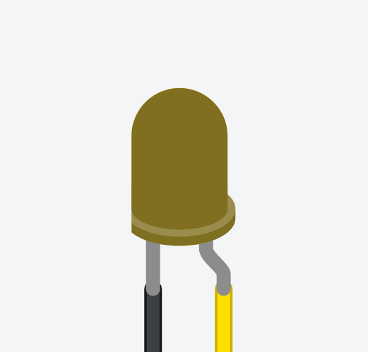
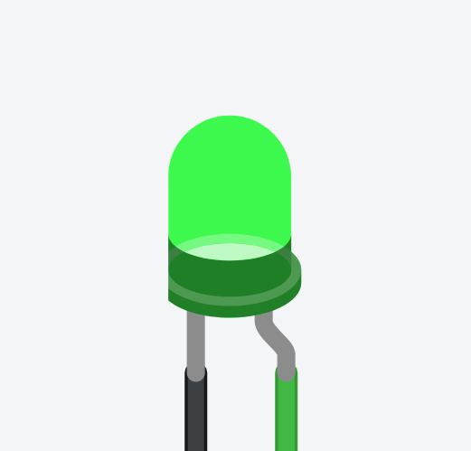
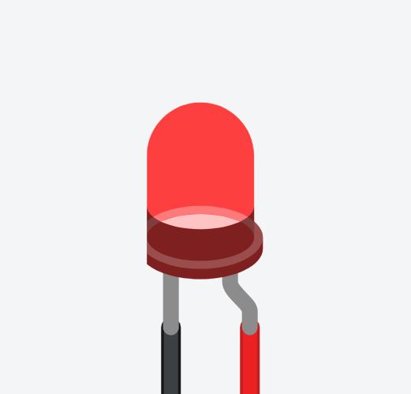

# LED Indication

Our manipulator has three LEDs to indicate system status to the operator. Each sequence and LED blinking has a meaning. In this file we explain each of them and the possible errors.

| LEVEL | RED | YELLOW | GREEN | Posible situations |
|--------|-----|--------|-------|--------------------|
| WAITING ||| | Searching for serial communication |
| SUCESS ||| | Connecting to computer |
| RUNNING ||| | System running and connected to computer |
| ERROR ||| | No connection found |
| CRITICAL FAILURE ||| |  MUTEX creation failure |